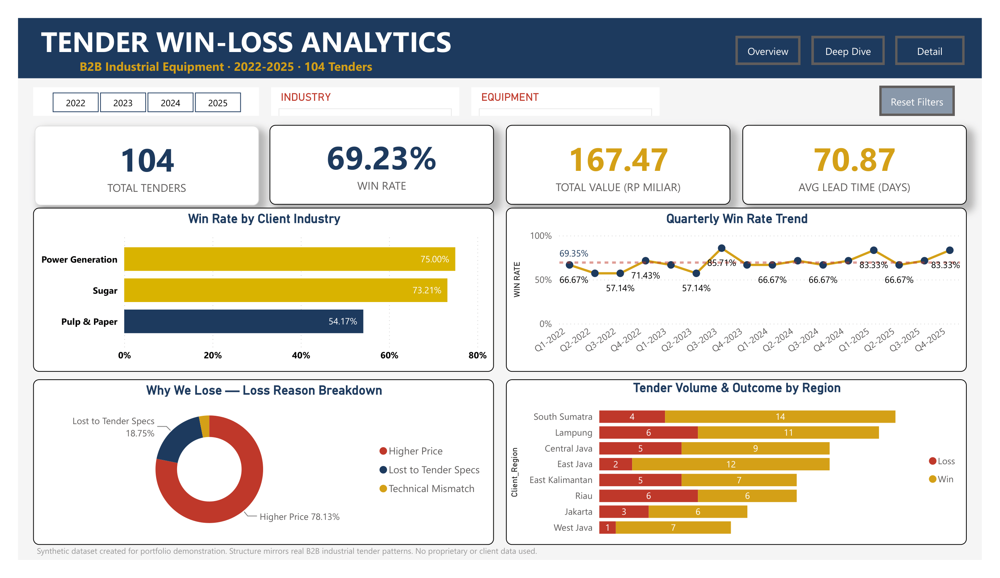
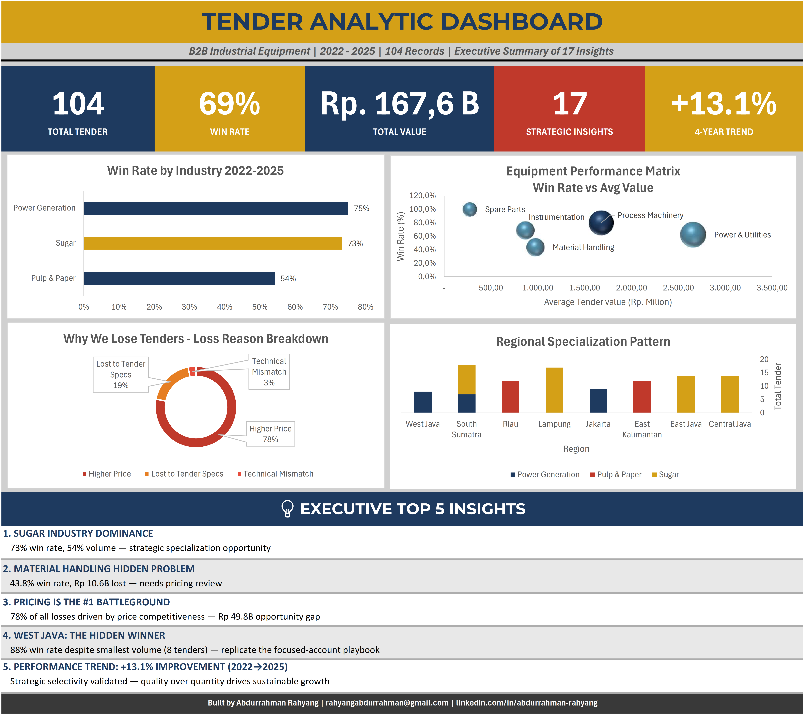

## Phase 2 — Power BI Interactive Dashboard

Three-page interactive dashboard with 12 DAX measures, slicer-driven
cross-filtering, and documented data-quality fixes.

[→ View Phase 2](powerbi/)



# 🏭 B2B Industrial Tender Analytics — Sugar Industry Focus

> **A 4-year deep dive into Indonesian B2B equipment tender patterns.**
> 17 strategic insights from 104 records. How can data systematically improve win rate?



---

## 🎯 Project Overview

This portfolio project analyzes **104 industrial equipment tenders (2022-2025)** across three B2B industries — Sugar, Power Generation, and Pulp & Paper — with deep focus on the **Indonesian sugar industry equipment supply chain**.

**Core question:** What separates winning tenders from losing ones — and how can data systematically improve win rate?

**Result:** 17 strategic insights organized across 5 analytical layers, from industry-level patterns down to regional pricing strategy implications.

---

## 👤 Why I Built This

I'm Abdurrahman — an **Applicant Engineer with 4+ years of real B2B tender experience**, transitioning into data analytics.

Throughout my career preparing technical & commercial proposals for sugar mills, paper plants, and power generation facilities, I noticed a pattern:

> Most tender decisions are made on gut feel.
> Yet every tender generates rich data — pricing, lead time, competitor patterns, win/loss reasons — that goes unanalyzed.

This project is what happens when you take that data and ask the right questions.

**My unique angle:** I'm not a data analyst learning B2B. I'm a **B2B specialist learning data**. The methodology came from 4+ years of preparing 100+ real tenders.

---

## 🛠️ Tools & Skills Demonstrated

| Skill | Application |
|-------|-------------|
| **Microsoft Excel (Advanced)** | Pivot Tables, COUNTIFS, SUMIFS, AVERAGEIFS, INDEX/MATCH, IFERROR, structured references |
| **Data Analysis** | Win/loss segmentation, trend analysis, regional cross-analysis, root cause investigation |
| **Data Visualization** | Combo charts, stacked bar, bubble matrix, doughnut charts, conditional formatting heatmaps |
| **Dashboard Design** | 1-page executive dashboard with KPI cards, multi-chart layout |
| **Business Intelligence** | Translating raw data into 17 strategic insights with strategic implications |

**Currently learning:** SQL (HackerRank Basic), Power BI, Python (Pandas)

---

## 📊 Dataset

**Size:** 104 tender records (2022-2025)
**Coverage:** 3 industries, 5 equipment categories, 8 regions
**Variables:** 18 fields

### ⚠️ Data Disclosure

**The dataset is fully synthetic.** Inspired by patterns I observed in 4+ years of professional B2B experience, but contains:
- ❌ NO real client names
- ❌ NO actual company financial data
- ❌ NO confidential pricing information
- ✅ Realistic distributions and patterns
- ✅ Industry-accurate equipment categories
- ✅ Plausible regional and seasonal patterns

This approach demonstrates analytical methodology without compromising any employer's confidentiality.

---

## 🔍 Analytical Approach (5 Layers, 17 Insights)

### LAYER 1 — Industry Performance (Insights #1-3)
- Win rate per industry (Sugar 73%, Power Gen 75%, Pulp & Paper 54%)
- "Hidden Champion" identification

### LAYER 2 — Equipment Category Deep Dive (Insights #4-9)
- Performance matrix across 5 equipment categories
- STAR / QUICK WIN / BIG DEAL / STEADY rating system
- Material Handling root cause investigation

### LAYER 3 — Loss Reason & Trend Analysis (Insights #10-14)
- Pricing as #1 loss driver (78% of losses)
- Preventable vs unavoidable losses
- Quarterly trend with strategic selectivity narrative

### LAYER 4 — Regional Cross-Analysis (Insights #15-17)
- Regional specialization map (8 regions × 3 industries)
- Hidden winner regions (West Java 88%, East Java 86%)
- Underperformer investigation (Riau 50%)

---

## 💡 Top 5 Strategic Insights

### 1. Sugar Industry = Strategic Specialization
- **73% win rate** dominating 54% of total volume
- 56 tender records across 4 Java/Sumatra regions
- **Action:** Position company as Sugar Industry Specialist

### 2. Pricing Is the #1 Battleground
- **78% of all losses** = "Higher Price" reason (Rp 49.8B opportunity gap)
- Cuts across all industries, all regions
- **Action:** Renegotiate principal pricing for price-sensitive markets

### 3. Material Handling = Hidden Problem (43.8% WR)
- Significantly below average win rate
- Rp 10.6B lost over 4 years
- **Action:** Strategic review or selective bidding

### 4. West Java: Hidden Winner
- **88% win rate** despite smallest volume (8 tenders)
- Pure single-industry focus
- **Action:** Replicate the focused-account playbook to volume regions

### 5. Performance Trend: +13.1% Improvement
- 2022 (63.1%) → 2025 (76.2%) over 4 years
- "Strategic Selectivity" narrative validated
- Quality over quantity drives sustainable growth

---

## 📈 Dashboard Preview

The 1-page executive dashboard summarizes all 17 insights in a single visual:


**Download:** [Tender Dashboard PDF](exports/Tender_Dashboard.pdf)

**Includes:**
- 5 KPI Cards (Total Tenders, Win Rate, Total Value, Insights, Trend)
- 4 Charts (Industry Win Rate, Equipment Matrix, Loss Reasons, Regional Pattern)
- 5 Strategic Insights summary
- Author signature

---

## 📂 Repository Structure

```
tender-analytics-portfolio/
├── README.md                          (you are here)
├── data/
│   └── tender_dataset.csv             (104 records, synthetic)
├── analysis/
│   └── Tender_Analysis_Master.xlsx    (full Excel: pivot tables + 17 insights)
├── docs/
│   ├── methodology.md                 (analytical approach explained)
│   ├── insights_regional.md           (deep dive on Regional Cross-Analysis)
│   └── project_overview.md            (project context)
├── images/
│   ├── tender_dashboard.png           (1-page executive dashboard)
│   ├── Equipment_Matrix_Chart.png     (bubble matrix)
│   ├── Loss_Reasons_Donut.png         (loss breakdown)
│   ├── Quarterly_Trend_Chart.png      (4-year trend)
│   └── Regional_Stacked_Bar_Chart.png (regional pattern)
└── exports/
    └── Tender_Dashboard.pdf            (printable executive version)
```

---

## 🚀 What's Next

This project is **Phase 1 (Excel)**. Coming next:

- **Phase 2 (Power BI):** Interactive dashboard with drill-through filters
- **Phase 3 (SQL):** Migrate dataset to SQLite, demonstrate complex queries
- **Phase 4 (Python):** Predictive modeling — predict win probability based on tender attributes

⭐ Star this repo for updates!

---

## 🤝 Let's Connect

I'm currently **open to opportunities** as:
- **Data Analyst** (Junior to Mid level)
- **Business Analyst** (B2B context)
- **Sales Analyst** / Pricing Analyst
- **Freelance Projects** in data analysis, dashboard design, technical documentation

📧 **Email:** rahyangabdurrahman@gmail.com
💼 **LinkedIn:** [linkedin.com/in/abdurrahman-rahyang](https://linkedin.com/in/abdurrahman-rahyang)
📍 **Location:** Surabaya, Indonesia (open to relocation/remote)

---

## 🇮🇩 Versi Bahasa Indonesia (Singkat)

Project portfolio ini menganalisis **104 data tender peralatan industri B2B (2022-2025)** dengan fokus utama pada industri gula Indonesia. Output: **17 strategic insights** dalam 5 lapisan analisa.

**Latar belakang:** Saya seorang Applicant Engineer dengan 4+ tahun pengalaman menyiapkan tender peralatan industri. Project ini menunjukkan bagaimana 4+ tahun pengalaman B2B saya bisa diterjemahkan ke dalam analisis data yang bernilai bisnis.

**Hasil utama:**
- ✅ Industri gula sebagai segmen utama (73% win rate, 54% volume)
- ✅ Power Generation hidden champion (75% win rate)
- ✅ Pricing = 78% penyebab kekalahan tender
- ✅ Spare Parts 100% win rate (quick win opportunity)
- ✅ West Java hidden winner dengan 88% win rate
- ✅ Performance improvement +13.1% (4 tahun)

**Tools:** Excel Advanced (Pivot Tables, COUNTIFS, charts, dashboard)
**Sedang dipelajari:** SQL, Power BI, Python

Saat ini terbuka untuk peluang sebagai Data Analyst, Business Analyst, atau freelance projects.

📩 Kontak: rahyangabdurrahman@gmail.com

---

## 📜 License

MIT License — feel free to learn from or adapt the methodology.

---

⭐ **If you found this project useful, please give it a star!** It helps build credibility for a career switcher transitioning into data analytics.
